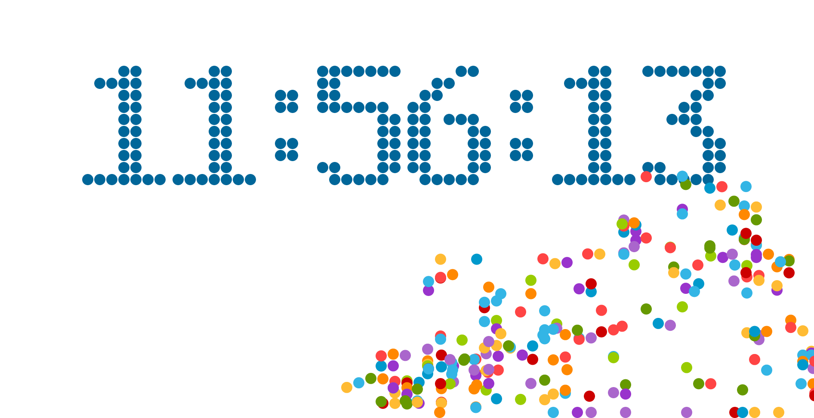
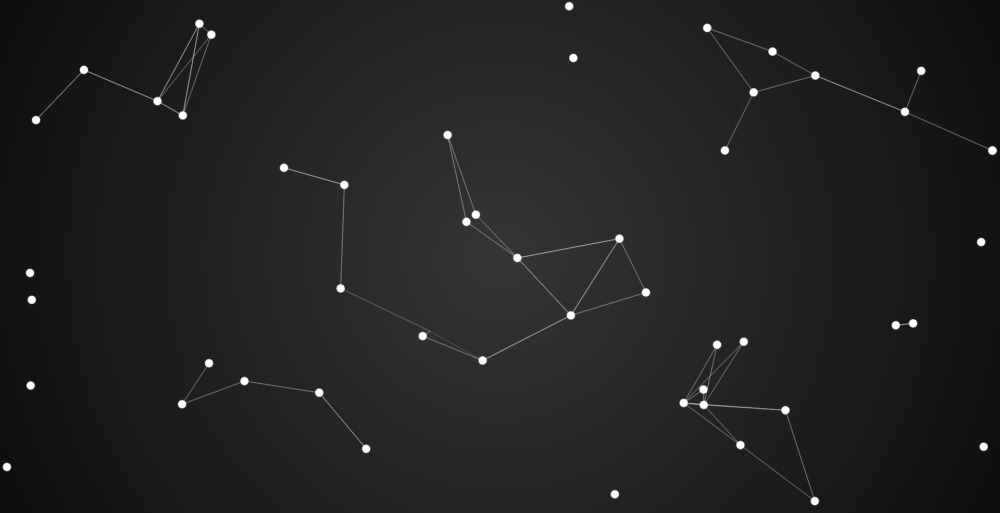

***
## canvas实例
1. canvas时钟
[动效时钟](https://vtrust.github.io/canvasLearn/timeDemo/index.html)

<!-- more -->
2. canvas粒子动效
以前在网上看到过，学了canvas后觉得可以做便做了出来
[粒子动效](https://vtrust.github.io/canvasLearn/ParticleDynamicEffect/ParticleDynamicEffect.html)

2016-11-26

## canvas深入学习
### 绘图环境获取
```
var canvas = document.getElementById('canvas');
var context = canvas.getContext('2d');
```
context即为2d绘图环境

### moveTo(x,y)函数
`context.moveTo(100,100);`将画笔移动到（100，100）的位置，其中画布的左上角为坐标原点，向右为x正方向，向下为y正方向。

### lineTo(x,y)函数
```
context.moveTo(100,100);//状态
context.lineTo(200,200);//状态
context.stroke();//绘制动作
```
绘制一条从（100，100）到（200，200）的直线。

### 绘制折线
```
context.moveTo(100,100);
context.lineTo(200,200);
context.lineTo(200,300);
context.stroke();//绘制动作
```
绘制一条从（100，100）到（200，200）再到（200，300）的折线。

### 线条属性
1. lineWidth
`context.lineWidth=10;`
设置了直线宽度
2. strokeStyle
`context.strokeStyle="#058";`
设置了直线颜色
3. lineCap（线段两端样式）
 `context.lineCap="butt";`（只适用于线段的开始和结束）
 - butt(default) 默认
 - round 圆角
 - square 方角（可以产生和closePath一样的闭合效果)
4. lineJion(线段相交处样式)
 - miter(default) 尖角
 - bevel 斜接
 - round 圆角  

### canvas是基于状态绘图的

### beginPath()方法
`context.beginPath()` 用于全新绘制一段路径，如果一个属性值没有被改变，那么beginPath方法依然会保持这一个属性。

### closePath()方法
`context.closePath()` 用于绘制一段闭合路径，可以解决线段宽度问题，并且可以省略一个lineTo函数。

### fillStyle属性 fill()方法
1. 简单用法
```
    context.fillStyle="yellow";
    context.fill();
```
用于填充多边形的颜色。对调fill()和stroke()方法的顺序可以解决描边被覆盖的问题。
2. 渐变色用法
- Linear Gradient线性
```
var skyStyle=context.createLinearGradient(0,0,0,canvas.height);//创建渐变线
skyStyle.addColorStop(0.0,"black");//添加颜色关键值 浮点数代表颜色在渐变线的位置
skyStyle.addColorStop(1.0,"#305");//添加颜色关键值
context.fillStyle = skyStyle;
context.fillRect(0, 0, canvas.width, canvas.height);
```
- Radial Gradient径向
```
        //创建 参数为第一个圆形的原点和半径 第二个圆的原点和半径
        var skyStyle=context.createRadialGradient(x0,y0,r0,x1,y1,r1);
        skyStyle.addColorStop(0.0,"black");//添加颜色关键值 浮点数代表颜色在渐变线的位置
        skyStyle.addColorStop(1.0,"#305");//添加颜色关键值
        context.fillStyle = skyStyle;
        context.fillRect(0, 0, canvas.width, canvas.height);
        ```  
        - createPattern
          ```Javascript
          var backgroundImage=new Image();
          backgroundImage.src="example,jpg";
          backgroundImage.onload=function(){
            //参数为no-repeat repeat repeat-x repeat-y  
            //backgroundImage还可以用canvas画布或vide
            var pattern=context.createPattern(backgroundImage,"no-repeat");
            context.fillStyle=pattern;
            context.fillRect(0,0,800,800);
          }
```
    同样fillStyle的特性也适用于strokeStyle上。  

### 绘制矩形
1. rec(x,ywidth,height)函数 单纯绘制矩形
2. fillRect(xy,width,height)函数 绘制矩形并且应用当前填充色
3. strokeRect(x,y,width,height)函数 绘制矩形并且应用当前描边颜色

### 颜色的表示
1. rgb(255,255,255) 数字分别对应红，绿，蓝
2. rgba(255,255,255,0.8) 数字分别对应红，绿，蓝，透明度

### 圆形绘制
arc(x,y, RADIUS, 0, p, bool)函数 `context.arc(100,100, 10, 0, 0, 2 * Math.PI, true);`

### 图形变换
综合考虑是否使用图形变换。

1. 位移 translate(x,y)
  存在陷阱
```
var context=canvas.getContext("2d");
context.fillStyle="red";
context.translate(100,100);
context.fillRect(0,0,400,400);
context.fillStyle="green";
context.translate(300,300);
context.fillRect(0,0,400,400);

/*你以为green方形移动到了（300,300）？其实不然，它实际上移动到了（400,400），因为translate是可叠加的。为此我们可以在绘图结束后再反向操作。*/
var context=canvas.getContext("2d");
context.fillStyle="red";
context.translate(100,100);
context.fillRect(0,0,400,400);
context.translate(-100,-100);//
context.fillStyle="green";
context.translate(300,300);
context.fillRect(0,0,400,400);
context.translate(-300,-300);//

/*或者使用（**推荐使用**）*/
var context=canvas.getContext("2d");
context.save();//
context.fillStyle="red";
context.translate(100,100);
context.fillRect(0,0,400,400);
context.restore();//
context.save();//
context.fillStyle="green";
context.translate(300,300);
context.fillRect(0,0,400,400);
context.restore();//
```
2. 旋转 rotate(deg)
3. 缩放 scale(sx,sy)
**注意** scale不仅改变了大小还改变了初设的(x,y),lineWidth属性，可适当放弃一些效果来减小副作用或者自己设计方法解决。
4. transform(a,b,c,d,e,f)函数
 对应一个变换矩阵
 ```
 |a c e|= |1 0 0|  
 |b d f|= |0 1 0|  
 |0 0 1|= |0 0 1|
 ```
 - a水平缩放（1）
 - b水平倾斜（0）
 - c垂直倾斜（0）
 - d垂直缩放（1）
 - e水平位移（0）
 - f垂直位移（0)
多次调用产生效果为叠加。

5. setTransform(a,b,c,d,e,f)函数
用于忽略掉之前的所有transform,重置为单位矩阵，再按照setTransform函数中的参数进行变换。
```
    context.transform(1,0,0,1,50,100);
    context.transform(2,0,0,1.5,0,0);
    context.setTransform(1,0,0,1,100,100);
```
最终保留setTransform的变换。

### 曲线绘制
1. artTo(x0,y0,x1,y1,r)
终止于切点处
2. Bezier
- quadraticCurveTo(x0,y0,x1,y1)
(x0,y0)为控制点， (x1,y1)为终点
- bezierCurveTO(x0,y0,x1,y1,x2,y2)
(x0,y0)， (x1,y1)为控制点， (x2,y2)为终点

### 文字
#### context.font属性
1. font-style
 - normal(default)
 - italic(倾斜字)
 - oblique（倾斜字体）
2. font-variant
 - normal(default)
 - small-caps(英文小写字母变成小型大写字母)
3. font-weight
 - lighter(新)
 - normal(default)
 - bold
 - bolder(新)
 - 100,200,300,400(normal),500,600,700(bold),800,900
4. font-size
 - px
 - em
 - %
5. font-family

### 图形关系
1. globalAlpha
2. globalCompositeOperation
 - source-over 后面图形遮盖前面
 - source-atop
 - source-in
 - source-out
 - destination-over 前面图形遮盖后面
 - destination-atop
 - destination-in
 - destination-out
 - lighter
 - copy
 - xor

### 剪辑区域
clip()剪切出一个区域用于绘制

### 点击判断
isPointInPath(x,y)

