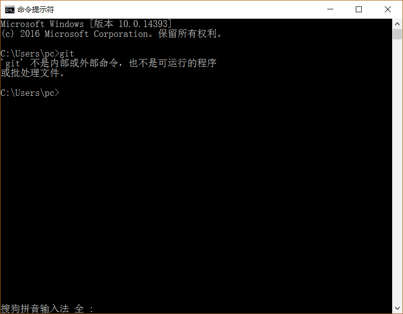
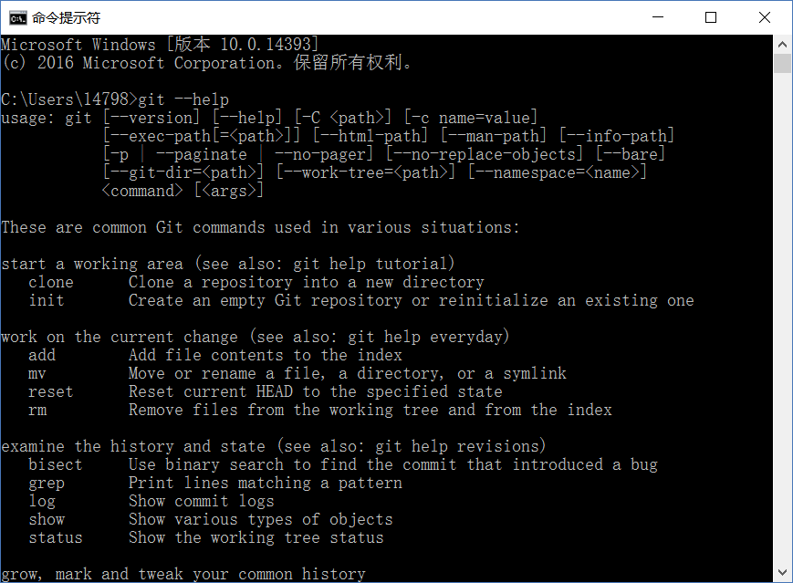
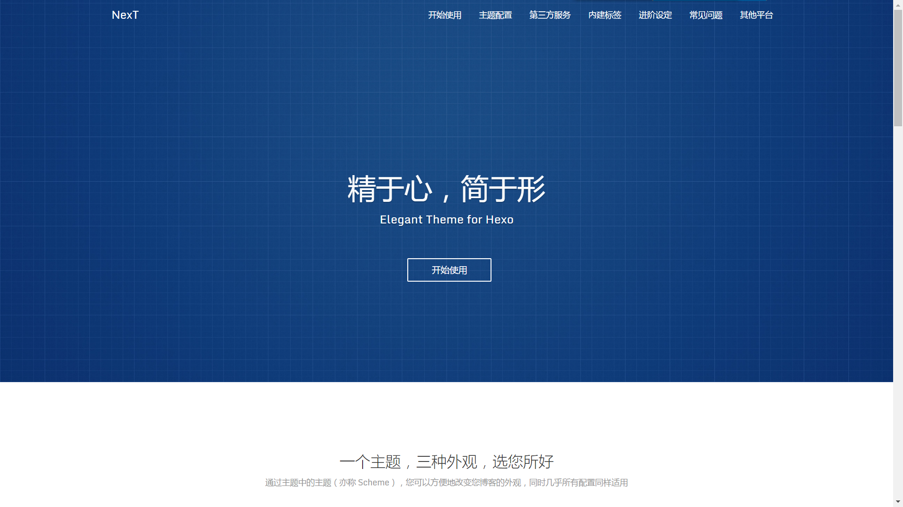
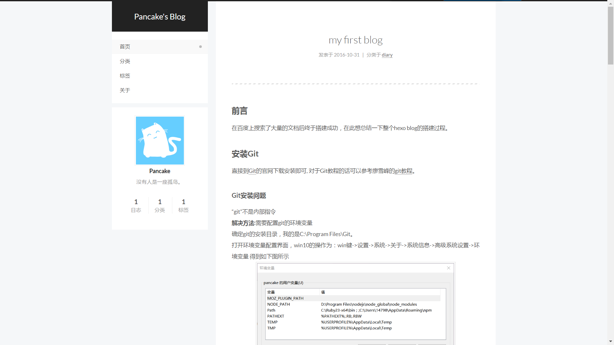

***
## 前言
在百度上搜索了大量的文档后终于搭建成功，在此想总结一下整个hexo blog的搭建过程。

## 安装Git
直接到[Git](https://git-scm.com/downloads)的官网下载安装即可， 对于Git教程的话可以参考廖雪峰的[git教程](http://www.liaoxuefeng.com/wiki/0013739516305929606dd18361248578c67b8067c8c017b000/)。

## Git安装问题
“git”不是内部指令

<!-- more -->
**解决方法**：
需要配置git的环境变量
确定git的安装目录，我的是C:\Program Files\Git。
打开环境变量配置界面，win10的操作为：win键->设置->系统->关于->系统信息->高级系统设置->环境变量 得到如下图所示。

可以看到win10的变量配置分为了**用户变量**和**系统变量**，而我们需要配置的是**系统变量中的PATH的值**

首先点击新建，并且在输入框中随意输入一个字符（这样做可以避免原有环境变量被覆盖），然后点击浏览，浏览到git的安装目录下单击选中bin文件夹，最后点击确认即可。
打开CMD输入`git --help`

见到这个就说明成功了。
 
## 安装node.js
直接到[node.js](https://nodejs.org/en/)的官网下载安装即可。（暂时没发现node.js的问题）
打开CMD输入：
`node -v`
输出类似如下的版本号即可：
`v7.0.0`

## 安装hexo
在这之前请确保git与node.js安装成功。
打开CMD输入：
`$ npm install -g hexo-cli`
若出现error，请确保你的git版本与node的版本为最新版。
打开CMD输入：
`$ hexo -v`
输出类似如下的信息即可：
```
hexo-cli: 1.0.2
os: Windows_NT 10.0.14393 win32 x64
http_parser: 2.7.0
node: 7.0.0
v8: 5.4.500.36
uv: 1.9.1
zlib: 1.2.8
ares: 1.10.1-DEV
icu: 57.1
modules: 51
openssl: 1.0.2j
```

## 安装hexo主题

这里使用[NexT](http://theme-next.iissnan.com/)的主题。轻快简洁，且适配多种媒体。这是一款轻快简洁、适配多种媒体的主题，并且主题配备了十分完善的[文档](http://theme-next.iissnan.com/getting-started.html)。
我们只需按照步骤走一遍即可。
### 配置主题过程中我遇到的问题

#### 如何设置网页缩略图标
打开主题配置文件（yourBlog\themes\next_config.yml)，找到
```
# Put your favicon.ico into `hexo-site/source/` directory.
favicon:
```
字段，添加图片网址后更改为
```
# Put your favicon.ico into `hexo-site/source/` directory.
favicon:  https://example.png
```
#### 配置github
1. 到[github](https://github.com/)官网注册一个账号；
2. 登陆后点击绿色按钮（**New repository**），然后输入**Repository name**其格式要求为：**用户名.git.io**例如用户名为**pancake**则输入**pancake.git.io**
3. 最后点击**create**按钮即可。

#### 将hexo博客部署到github上
在这一步之前你需要参照廖雪峰[git教程](http://www.liaoxuefeng.com/wiki/0013739516305929606dd18361248578c67b8067c8c017b000/001374385852170d9c7adf13c30429b9660d0eb689dd43a000)把本地仓库和远程仓库建立连接。
打开站点配置文件（yourBlog_config.yml），找到
```
# Deployment
## Docs:  https://hexo.io/docs/deployment.html
deploy:
  type:
  repository:
  branch:
```
字段，并更改为
```
# Deployment
## Docs: https://hexo.io/docs/deployment.html
deploy:
  type: git//hexo3.0版本之后已经从github改为了git
  repository: https://github.com/yourName/yourName.github.io.git//你刚刚远程创建的仓库地址
  branch: master//仓库分支
```
完成后打开CMD，进入到博客的目录下，输入：
`$ npm install hexo-deployer-git --save`
等待片刻再输入
`$ hexo deploy`
最后打开浏览器输入：
http://**yourName**.github.io/ 查看即可。

#### 更改博文后再次提交到github
你需要按照如下步骤进行操作
使用CMD进入到博客目录下，然后依次输入：
```
$ hexo clean
$ hexo generate
$ hexo deploy
```
最后再次刷新页面即可。

最终效果如图。

#### hexo草稿功能
在blog根目录下使用`$ hexo new draft "new draft"`创建草稿
可以使用`$ hexo server --drafts`来在本地浏览器预览博文
若想发布文章，只需要把md文件中的`layout: draft`删除即可。

#### 上传github博客只有框架没有内容的问题

GitHub Pages 过滤掉了 source/vendors 目录的访问,所以deploy之后打开主页是一片空白。
解决方案是更新主题文件或者手动配置。
手动将 source/vendors 目录修改成 source/lib(或是其他的名称，lib亲测可用)。
同时,修改下主题配置文件_config.yml, 将internal: vendors 改成你所修改的名字。
来源于[知乎](https://www.zhihu.com/question/52251404/answer/129979612)
