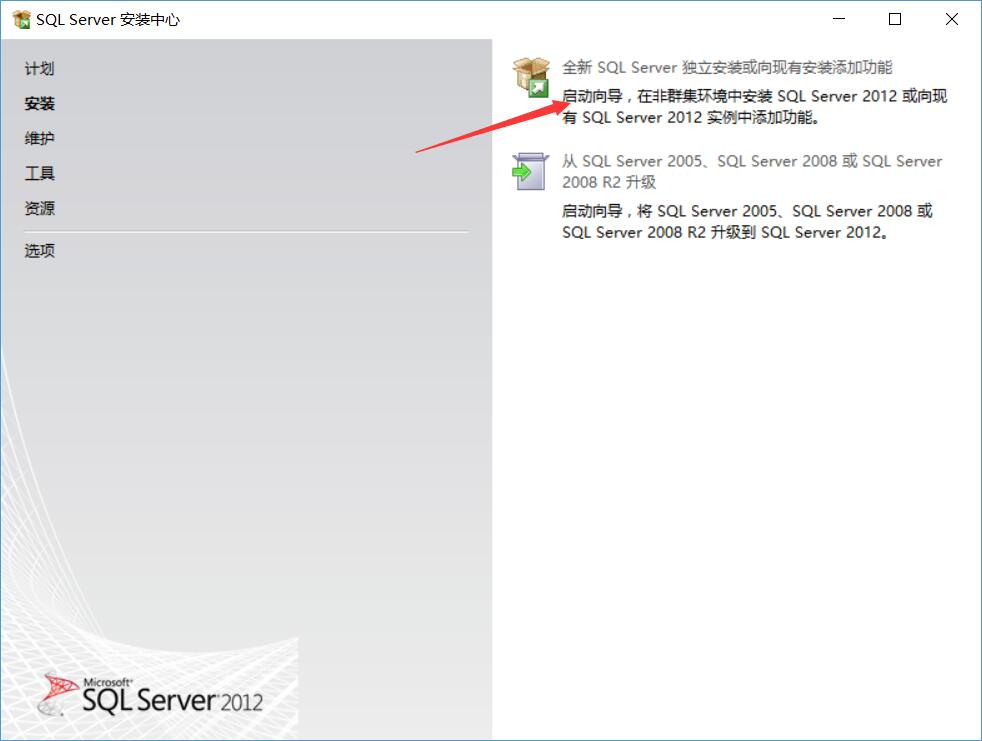
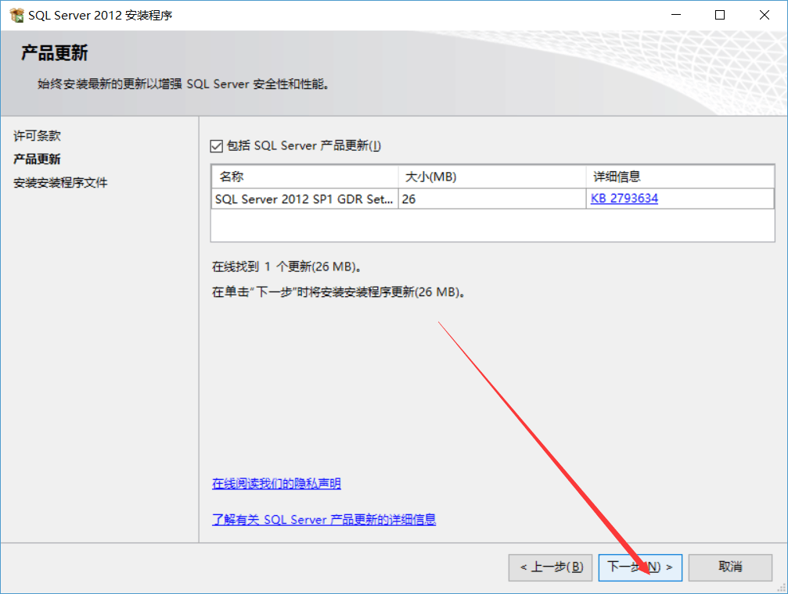
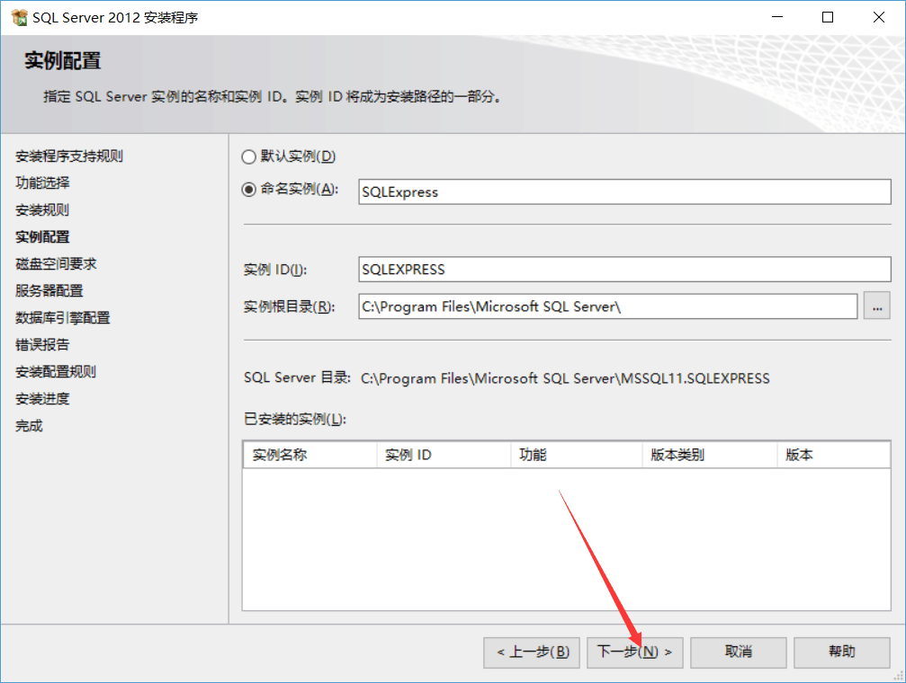
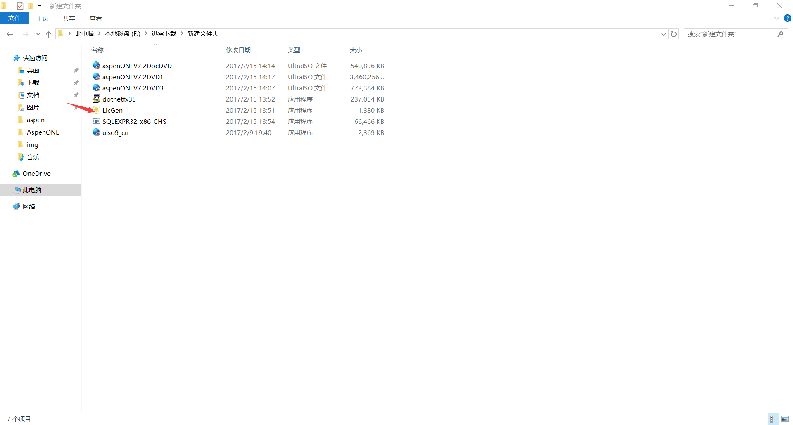
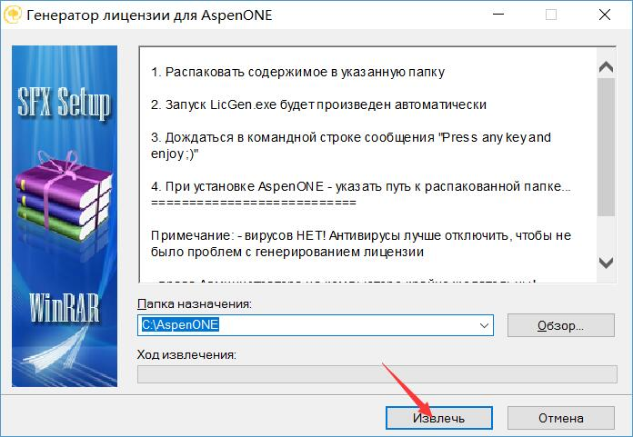
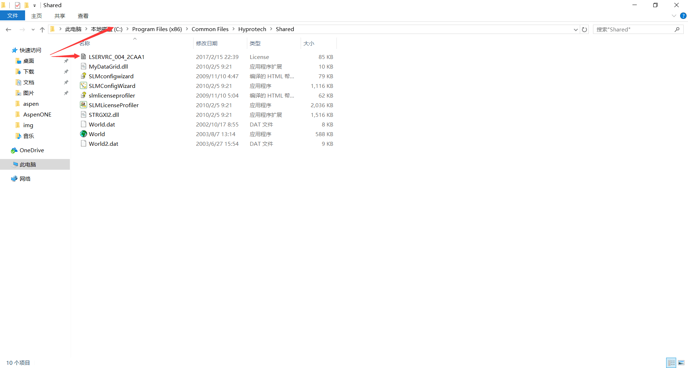
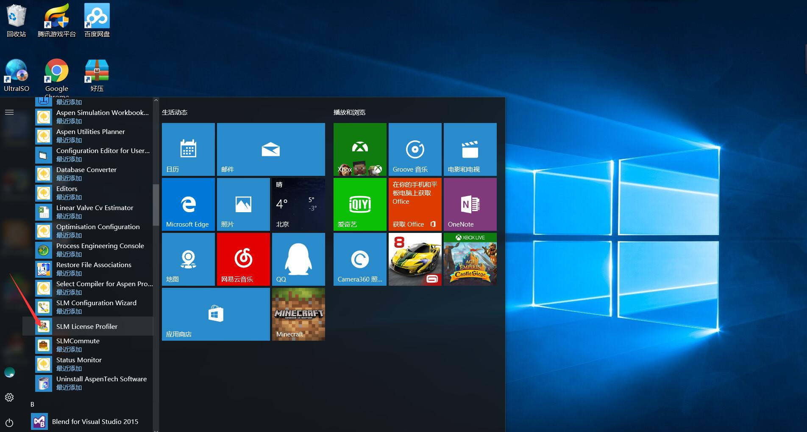
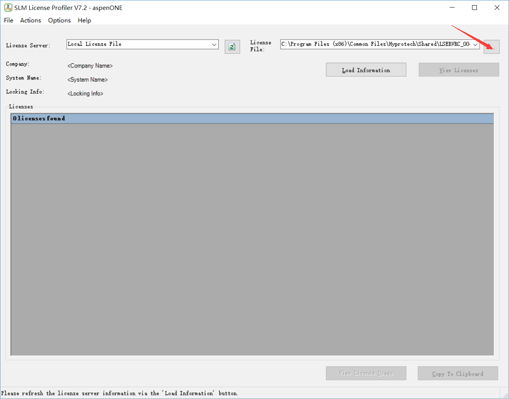
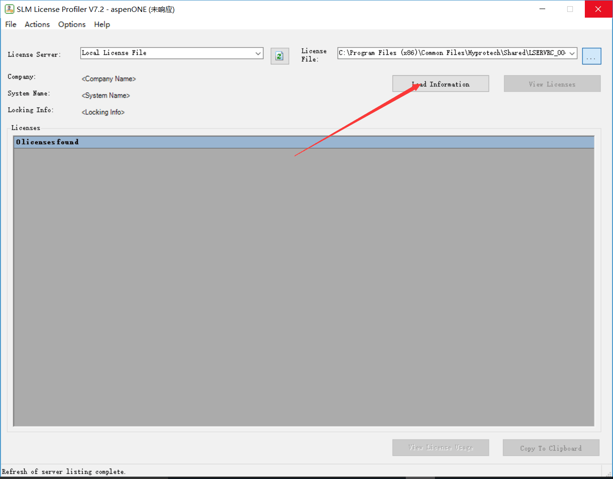

***
## 安装步骤

### 下载文件
 - [SQL sever 2012](https://www.microsoft.com/zh-cn/download/details.aspx?id=29062)
 64位计算机选择**SQLEXPRWT_x64_CHS.exe**即可
 32位计算机选择**SQLEXPRWT_x86_CHS.exe**即可
 
  <!-- more -->
 - [Microsoft .NET Framework 4.5](https://www.microsoft.com/zh-cn/download/details.aspx?id=30653)
 
 - [aspen7.2](http://data.mahoupao.net/forum/201207/28/aspen%20v7.2%E8%BF%85%E9%9B%B7%E8%BF%9E%E6%8E%A5%E4%B8%8B%E8%BD%BD.txt)
 ([来源于“马后炮化工”论坛](http://bbs.mahoupao.net/forum.php?mod=viewthread&tid=47461))
 打开迅雷后复制链接中的字符即可
    

### 安装
- **SQL sever 2012**
双击打开**SQLEXPRWT_x64_CHS.exe**

- **Microsoft .NET Framework 4.5**
默认安装即可
出现下图则关闭安装程序即可

- aspen
参见[百度教程](http://jingyan.baidu.com/article/b907e627ce1ece46e7891cb6.html) 按步骤操作即可
- 打开Aspen Plus User Interface即可使用  

## 安装问题
- **Unable to acquire Aspenplus license**
[解决方法](http://bbs.mahoupao.net/thread-64568-1-1.html)
打开**LicGen**

把重新生成的.lic文件复制到 并且删除掉原来的.lic文件
`C:\Program Files (x86)\Common Files\Hyprotech\Shared`

打开**SLM License Profiler**

选择.lic文件

再次打开**Aspen Plus User Interface**即可使用
